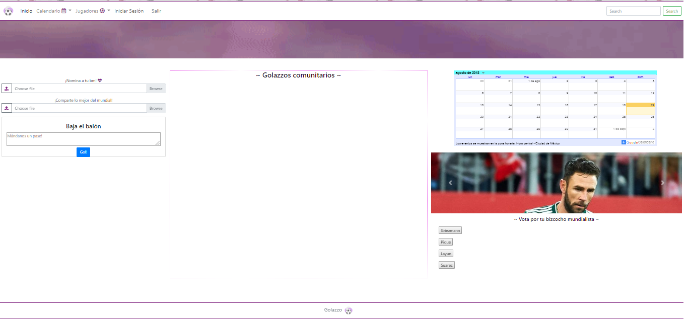
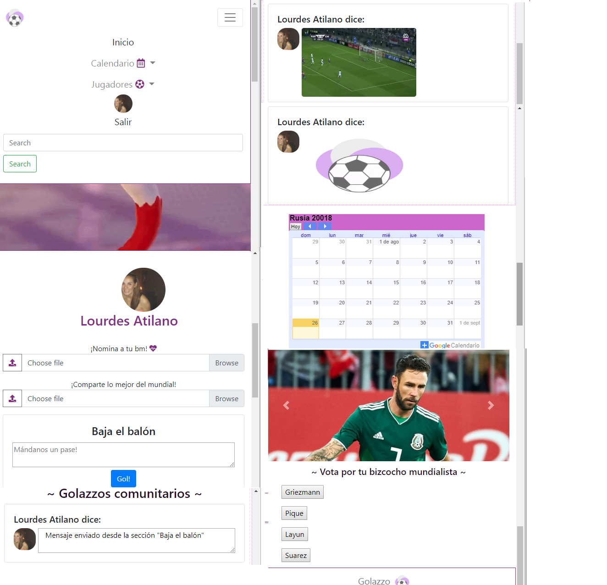

# Golazzo

Este repositorio contiene el ejercicio para la creación de una red social con temática futbolística inspirada en el mundial Rusia 2018, se utilizó: Bootstrap, Fontawesome, Jquery y Firebase.

---
## Descripción

Golazzo es una red social diseñada para compartir opiniones, fotografías, videos, noticias relacionadas con: jugadas, jugadores, equipos o selecciones de fútbol. 

Las imágenes y videos se ingresan en el input "¡Comparte lo mejor del mundial! y las noticias u opiniones en el apartado "Baja el balón", el material aparecerá en la sección central de "~ Golazzos comunitarios ~.

En la sección "Bizochitos Mundialistas" puedes observar los canditatos propuestos y votar por tu jugador favorito, también puedes ingresar nuevos candidatos con el input "!Nomina a tu bm <3!

Finalmente en la sección de Calentandario, apareceren cuando fueron celebrados los partidos durante el mundial Rusia 2018.

### Se utilizó:
* Jquery
* Bootstrap (Diseño responsivo: mobile y desktop)
* Firebase ( Auth, Database y Storage )
* Fontawesome - icons
* CSS3
* HTML5
* API de Google Calendar

### Vista Desktop:

### Vista Mobile:

---
## Autoras

**Lourdes Atilano y Orquídea Campos**

---
## Desarrollado para 
[Laboratoria](https://laboratoria.la)
